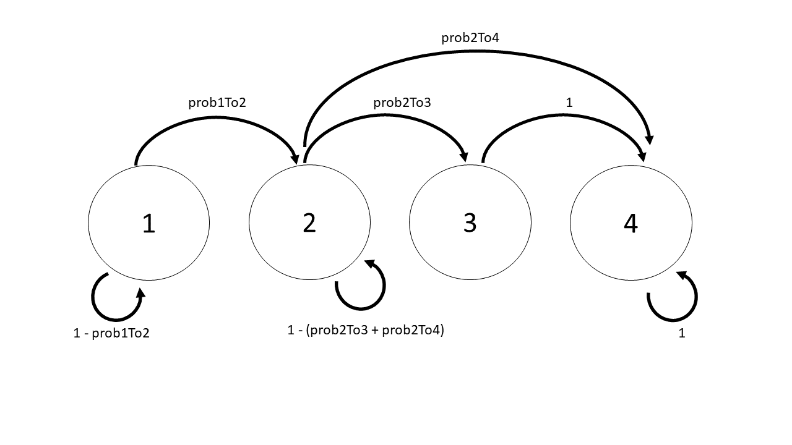

  
```{r setup, include=FALSE}
knitr::opts_chunk$set(echo = TRUE)
knitr::opts_chunk$set(fig.width = 7, fig.height = 7) 
```

In this vignette, we demonstrate how to use the nimbleSCR [@nimbleSCR] and NIMBLE packages [@de2017programming;@nimbleSoftware2020] to simulate open-population spatial capture-recapture (OPSCR) data and fit flexible and efficient Bayesian OPSCR models with spatially hetereogenous mortality. We assume that we have access to detections of individuals alive but also dead recovery locations [@Dupont2021]. The OPSCR model is parameterized using a hazard rate formulation and two competing cause of mortality. For one cause of mortality (e.g. culling), we assume that all mortality events are recovered with an associated death location. See details in Milleret et al 2022 Estimating spatially variable and density-dependent survival using open-population spatial capture-recapture models; Ecology

```{r, warning = FALSE, message = FALSE}
## Load packages
library(nimble)
library(nimbleSCR)
library(basicMCMCplots)
```


## 1. Simulate SCR data
### 1.1 Habitat and trapping grid

As an example, we create a $16 \times 16$ habitat grid with a resolution of 4 for each dimension. On the habitat, we center a $16 \times 16$ trapping grid with a resolution of 1 for each dimension.   

```{r , warning = FALSE, message = FALSE}
## Create habitat grid
coordsHabitatGridCenter <- cbind(rep(seq(23, 8, by = -5), 4),
                                 sort(rep(seq(8, 23, by = 5), 4)))
colnames(coordsHabitatGridCenter) <- c("x","y")

## Create trap grid
coordsObsCenter <- cbind(rep(seq(8, 23, by = 1), 16),
                         sort(rep(seq(23, 8, by = -1), 16)))
colnames(coordsObsCenter) <- c("x","y")

## Plot check
plot(coordsHabitatGridCenter[,"y"] ~ coordsHabitatGridCenter[,"x"],
     xlim = c(5,25), ylim = c(5,25),
     pch = 1, cex = 1.5) 
points(coordsObsCenter[,"y"] ~ coordsObsCenter[,"x"], col="red", pch=16 ) 
par(xpd=TRUE)
legend(x = 7, y = 7,
       legend=c("Habitat window centers", "Observation window centers"),
       pt.cex = c(1.5,1),
       horiz = T,
       pch=c(1,16),
       col=c("black", "red"),
       bty = 'n')

       
habitatMask <- matrix(1, nrow = 4, ncol= 4, byrow = TRUE)
```

### 1.2 Rescale coordinates

To implement the local evaluation approach when fitting the SCR model (see @Milleret2019 and @Turek2021 for further details), we need to rescale the habitat and trapping grid coordinates so that each habitat cell is of dimension $1 \times 1$. We also need to identify the lower and upper coordinates of each habitat cell using the 'getWindowCoords' function.

```{r , warning = FALSE, message = FALSE}
## Rescale coordinates
scaledObjects <- scaleCoordsToHabitatGrid(
  coordsData = coordsObsCenter,
  coordsHabitatGridCenter = coordsHabitatGridCenter)

## Get lower and upper cell coordinates
lowerAndUpperCoords <- getWindowCoords(
  scaledHabGridCenter = scaledObjects$coordsHabitatGridCenterScaled,
  scaledObsGridCenter = scaledObjects$coordsDataScaled,
  plot.check = F)

```

We set up the objects necessary to perform the local evaluation for the live detection using the 'getLocalObjects' function. Special care should be taken when chosing 'dmax' relative to $\sigma$ [@Milleret2019]. Here we are using a value $>3*\sigma$ (see below for the $\sigma$ chosen).

```{r , warning = FALSE, message = FALSE}
trapLocal <- getLocalObjects(habitatMask = habitatMask,
                             coords = scaledObjects$coordsDataScaled,
                             dmax = 1,
                             resizeFactor = 1,
                             plot.check = F
)
```

We create the local objects to perform the local evaluation for the dead recovery locations using the 'getLocalObjects' function. In this model, we assume that dead recoveries can be detected anywhere in the spatial domain (including the buffer). We therefore use the coordinates of the entire spatial domain (and not only the detector coordinates) to define the local objects.

```{r , warning = FALSE, message = FALSE}
deadObsLocal <- getLocalObjects(habitatMask = habitatMask,
                             coords = scaledObjects$coordsHabitatGridCenterScaled,
                             dmax = 2,
                             resizeFactor = 1,
                             plot.check = F
)

```

### 1.3 Define model code
Here, we built an OPSCR model assuming a Markovian and bivariate distribution of the movement of individual activity centers across occasions. 
Concerning the demographic model, we used a multi-state model where each individual life history is represented by a succession of up to four discrete state $z_{i,t}$:
1) 'unborn' if the individual has not been recruited in the population;
2) 'alive' if it is alive;
3) 'culled' if it was culled and recovered dead between the start of the previous and current occasion;
4) 'dead' if it was died but was not recovered dead. Full details are available in Milleret et al. 

```{r state, warning = FALSE, echo = FALSE , fig.cap="State transition", message = FALSE, out.width = "65%", fig.align = 'center'}

```


```{r , warning = FALSE, message = FALSE}
modelCode <- nimbleCode({
  ##--------------------------------------------------------------------------------------------
  ##-----------------------------## 
  ##------ SPATIAL PROCESS ------##  
  ##-----------------------------##
  tau ~ dgamma(0.001, 0.001)
  logHabIntensity[1:numHabWindows] <- mu[1:numHabWindows]
  sumHabInt <- log(sum(mu[1:numHabWindows]))
  ## FIRST YEAR 
  for(i in 1:M){
    s[i, 1:2,1] ~ dbernppAC(
      lowerCoords = lowerHabCoords[1:numHabWindows, 1:2],
      upperCoords = upperHabCoords[1:numHabWindows, 1:2],
      logIntensities = logHabIntensity[1:numHabWindows],
      logSumIntensity = sumHabInt,
      habitatGrid = habitatGrid[1:y.max,1:x.max],
      numGridRows =  y.max,
      numGridCols = x.max
    )
  }#i
  
  ## T>1 
  for(t in 2:n.years){
    for(i in 1:M){
      s[i, 1:2, t] ~ dbernppACmovement_normal(lowerCoords = lowerHabCoords[1:numHabWindows, 1:2]
                                                , upperCoords = upperHabCoords[1:numHabWindows, 1:2]
                                                , s = s[i, 1:2, t - 1]
                                                , sd = tau
                                                , baseIntensities = mu[1:numHabWindows]
                                                , habitatGrid =  habitatGrid[1:y.max,1:x.max]
                                                , numGridRows = y.max
                                                , numGridCols = x.max
                                                , numWindows= numHabWindows
      )
    }#i
  }#t
  
  ##--------------------------------------------------------------------------------------------
  ##-------------------------------## 
  ##----- DEMOGRAPHIC PROCESS -----## 
  ##-------------------------------##    
  ## INTERCEPT MORTALITY HAZARD RATES
  mhH ~ dunif(-10, 10)
  mhW ~ dunif(-10, 10)
  
  ## CAUSE SPECIFIC SLOPE MORTALITY 
  betaH ~ dunif(-10,10)
  betaW ~ dunif(-10,10)
  
  ## FIRST YEAR INCLUSION PARAMETER 
  gamma1 ~ dunif(0,1)
  omeg1[1:2] <- c(1-gamma1, gamma1)
  
  ## TIME SPECIFIC INCLUSION PARAMETER 
  for(t in 1:n.years1){
    gamma[t] ~ dunif(0,1)
  }#t
  
  ## SPATIAL SURVIVAL
  ## SURVIVAL (CAUSE-SPECIFIC MORTALITY SPATIALLY EXPLICIT)
  mhH1[1:numHabWindows] <- exp(mhH + betaH * habCov[1:numHabWindows])
  mhW1[1:numHabWindows] <- exp(mhW + betaW * habCov[1:numHabWindows])
  
  ## DERIVE MORTALITY AND SURVIVAL PROBABILITIES 
  phi[1:numHabWindows] <- exp(-(mhH1[1:numHabWindows] + mhW1[1:numHabWindows]))
  h[1:numHabWindows] <-  (1 - phi[1:numHabWindows]) * (mhH1[1:numHabWindows]/(mhH1[1:numHabWindows] +
                         mhW1[1:numHabWindows]))
  w[1:numHabWindows] <-  (1 - phi[1:numHabWindows]) * (mhW1[1:numHabWindows]/(mhH1[1:numHabWindows] +
                         mhW1[1:numHabWindows]))
  
  ## STATE TRANSITION 
  for(i in 1:M){ 
    z[i,1] ~ dcat(omeg1[1:2]) 
    for(t in 1:n.years1){
      z[i,t+1] ~ dcatState1Alive2Dead( z = z[i,t]
                                     , prob1To2 = gamma[t]
                                     , prob2To3Hab = h[1:numHabWindows]
                                     , prob2To4Hab = w[1:numHabWindows]
                                     , s = s[i,1:2,t]
                                     , habitatGrid = habitatGrid[1:y.max,1:x.max])
    }#i 								
  }#t 
  
  ##---------------------------------------------------------------------------------------------   
  ##-----------------------------##
  ##----- DETECTION PROCESS -----## 
  ##-----------------------------##
  sigma ~ dunif(0,15)
  p0 ~ dunif(0,1)
  
  for(t in 1:n.years){
    for (i in 1:M){
      
      ## ALIVE DETECTIONS 
       y[i, 1:lengthYCombined,t] ~ dbinomLocal_normal(size = trials[1:n.traps],
                                                 p0 = p0,
                                                 s = s[i,1:2,t],
                                                 sigma = sigma,
                                                 trapCoords = trapCoords[1:n.traps,1:2],
                                                 localTrapsIndices = trapIndex[1:n.cells,1:maxNBDets],
                                                 localTrapsNum = nTraps[1:n.cells],
                                                 resizeFactor = resizeFactor,
                                                 habitatGrid = habitatIDDet[1:y.maxDet,1:x.maxDet],
                                                 indicator = isAlive[i,t],
                                                 lengthYCombined = lengthYCombined)
      
      
      ## DEAD RECOVERY 
      y.dead[i, 1:3,t] ~ dbernppLocalDetection_normal(
                    lowerCoords= lowerHabCoords[1:numHabWindows,1:2]
                  , upperCoords= upperHabCoords[1:numHabWindows,1:2]
                  , s = s[i,1:2,t]
                  , sd = sigma
                  , baseIntensities = detReco[1:numHabWindows]
                  , habitatGridLocal=habitatGridLocal[1:y.max,1:x.max]
                  , resizeFactor=resizeFactor
                  , localObsWindowIndices = localObsWindowIndices[1:numHabWindows,1:maxNBDetsReco]
                  , numLocalObsWindows = numLocalObsWindows[1:numHabWindows]
                  , numWindows = numHabWindows
                  , indicator = z[i,t]==3
      )
    }#i
  }#t
  
  ##---------------------------------------------------------------------------------------------										
  ##----------------------------------------## 
  ##---------- DERIVED PARAMETERS ----------##
  ##----------------------------------------##
  for(i in 1:M){ 
    isAlive[i,1] <- (z[i,1] == 2) 
    for(t in 1:n.years1){
      isAlive[i,t+1] <- (z[i,t+1] == 2) 
    }
  }
  for(t in 1:n.years){
    N[t] <- sum(isAlive[1:M,t])
  }#t
})
```


### 1.4 Define parameter values to simulate

The model formulation uses data augmentation to derive N estimates [@Royle2012]. We therefore need to choose the total number of individuals *M* (detected + augmented).

```{r , warning = FALSE, message = FALSE}
M <- 500

## ASSIGN SIMULATED VALUES 
p0 <- 0.2
sigma <- 0.4

## EXPECTED NUMBER OF INDIVIDUALS ALIVE (z=2) AT t=1
n.individualsT1 <- 200
n.years <- 5
mhW <- -2
mhH <- -2

betaH <- 1
betaW <- -1
tau <- 1.2

recruitment <- 0.3  
## calculate the gamma 
gamma <- n.individualsT1/M
Recruit <- n.individualsT1*recruitment ## 40 % of recruitment 
NeverAlive <- n.individualsT1
  
for(t in 2:n.years){
    Navai  <- M- NeverAlive[t-1]
    gamma[t] <- Recruit/Navai 
    NeverAlive[t] <- NeverAlive[t-1] + Recruit
}
  
```


We create a spatial covariate with a horizontal gradient that will be used to explain heterogeneity in mortality. 

```{r , warning = FALSE, message = FALSE}
habCov <- as.numeric(scale(lowerAndUpperCoords$lowerHabCoords[,2])[,1])
habCovImage <- lowerAndUpperCoords$habitatGrid
habCovImage[] <- habCov[lowerAndUpperCoords$habitatGrid]
image(habCovImage)

### plot expected surv/mortality prob as a function of covariate 
mhH1 <- exp(mhH + betaH*habCov)
mhW1 <- exp(mhW + betaW*habCov)
  
prob2To2 <- exp(-(mhH1 + mhW1))
prob2To3 <-  (1-prob2To2) * (mhH1/(mhH1 + mhW1))
prob2To4 <-  (1-prob2To2) * (mhW1/(mhH1 + mhW1))
  
plot(prob2To2 ~ habCov, ylim=c(0,1), type="b", ylab="Probability")
points(prob2To3 ~ habCov, col="red", type="b")
points(prob2To4 ~ habCov, col="blue", type="b")

legend("topright", 
       legend=c("prob2To2","prob2To3","prob2To4"), 
       col=c("black","red","blue"), lty=c(1,1,1))

```


When simulating detections using this formulation of the SCR model in NIMBLE, all the information about detections (where and how many) is stored in 'y' in that order (See ?dbinomlocal_normal for more details.):

* 'detNums' (total number of individual detections), 
* 'x' (number of individual detections at each trap), 
* 'detIndices' (id of the trap at which detections occur). 

We now need to provide the maximum number of spatial recaptures that can be simulated per individual. We recommend using 'trapLocal\$numlocalindicesmax' that defines the maximum number of traps available for detections when local evaluation is used. This will enable the simulation of as many spatial detections as allowed by the restrictions imposed by the local evaluation (defined by the 'dmax' argument from 'getLocalObjects').
This means that the length of the 'y' observation vector for each individual is equal to the length of $c(detNums, x, detIndices)$ and is therefore equal to $lengthYCombined = 1+ trapLocal\$numLocalIndicesMax * 2$. 

```{r , warning = FALSE, message = FALSE}
lengthYCombined <- 1 + trapLocal$numLocalIndicesMax*2
```

### 1.5 Create data, constants and inits objects 

```{r , warning = FALSE, message = FALSE}
nimConstants <- list(M = M,
                     n.years = n.years,
                     n.years1 = n.years-1,
                     n.traps = dim(scaledObjects$coordsDataScaled)[1],
                     y.max = dim(habitatMask)[1],
                     x.max = dim(habitatMask)[2],
                     y.maxDet = dim(trapLocal$habitatGrid)[1],
                     x.maxDet = dim(trapLocal$habitatGrid)[2],
                     ResizeFactor = trapLocal$resizeFactor,
                     n.cells = dim(trapLocal$localIndices)[1],
                     maxNBDets = trapLocal$numLocalIndicesMax,
                     trapIndex = trapLocal$localIndices,
                     nTraps = trapLocal$numLocalIndices,
                     habitatIDDet = trapLocal$habitatGrid,
                     lengthYCombined = lengthYCombined,
                     numHabWindows = dim(lowerAndUpperCoords$lowerHabCoords)[1],
                     maxNBDetsReco = deadObsLocal$numLocalIndicesMax)


nimData <- list(trapCoords = scaledObjects$coordsDataScaled,
                trials = rep(1, dim(scaledObjects$coordsDataScaled)[1]),
                lowerHabCoords = lowerAndUpperCoords$lowerHabCoords,
                upperHabCoords = lowerAndUpperCoords$upperHabCoords,
                habitatGrid = lowerAndUpperCoords$habitatGrid,
                detReco = rep(1, dim(lowerAndUpperCoords$lowerHabCoords)[1]),
                habCov = habCov,
                mu = rep(1, dim(lowerAndUpperCoords$lowerHabCoords)[1]),
                habitatGridLocal = deadObsLocal$habitatGrid,
                localObsWindowIndices = deadObsLocal$localIndices,
                numLocalObsWindows = deadObsLocal$numLocalIndices,
                resizeFactor = deadObsLocal$resizeFactor
                )

# We set the parameter values as inits
nimInits <- list(sigma = sigma,
                 p0=p0,
                 tau=tau,
                 gamma = gamma[2:n.years],
                 gamma1 = gamma[1],
                 mhW = mhW,
                 mhH = mhH,
                 betaH = betaH,
                 betaW = betaW) 
```


### 1.6 Create NIMBLE model

```{r , warning = FALSE, message = FALSE}
model <- nimbleModel( code = modelCode,
                      constants = nimConstants,
                      data = nimData,
                      inits = nimInits,
                      check = F,       
                      calculate = F)  
```


### 1.7 Simulate SCR data from the NIMBLE model

We first need to obtain the list of nodes that will be simulated. We used the 'getDependencies' function from NIMBLE. Using the 'simulate' function from NIMBLE, we will then simulate the activity center (AC) locations ('s'), the state of the individual ('z') and SCR observation data ('y'; 'y.dead') 


```{r , warning = FALSE, message = FALSE}
# FIRST WE GET THE NODES TO SIMULATE
nodesToSim <- model$getDependencies(c("p0","sigma","mhW", "mhH","mu",
                                      "gamma","tau","gamma1","betaH",
                                       "betaW"),
                                      self = F,
                                      downstream = T,
                                      returnScalarComponents = TRUE)
# THEN WE SIMULATE THOSE NODES 
set.seed(1)
model$simulate(nodesToSim, includeData = FALSE)
```

After running 'simulate', the simulated data are stored in the 'model' object. For example, we can access the simulated 'z' and check how many individuals were considered alive and recovered at each time step :

```{r , warning = FALSE, message = FALSE}
N <- apply(model$z,2,function(x)sum(x==2))
N

N.recoveredDead <- apply(model$z,2,function(x)sum(x==3))
N.recoveredDead
```

## 2. RUN MCMC WITH NIMBLE

Here, we build the NIMBLE model again using the simulated 'y' and 'y.dead' as data. For simplicity, we used the simulated 'z' as initial values. Then we can fit the OPSCR model with the simulated 'y' and 'y.dead' datasets.  

```{r , warning = FALSE, message = FALSE}
myZ <- model$z
z <- zInits <- model$z
whichDet <- apply(model$y, 3, function(x) x[,1]>0 )
whichNotDet <- apply(model$y, 3, function(x) x[,1]==0 )

# give NAS to individuals not detected
z[whichNotDet] <- NA
zInits[whichDet] <- NA

nimData$y <- model$y
nimData$y.dead <- model$y.dead

nimData$z <- z
nimInits$z <- zInits
nimInits$s <- model$s

# CREATE AND COMPILE THE NIMBLE MODEL
model <- nimbleModel( code = modelCode,
                      constants = nimConstants,
                      data = nimData,
                      inits = nimInits,
                      check = F,
                      calculate = F)
model$calculate()

```

```{r , eval=T, warning = FALSE, message = FALSE}
cmodel <- compileNimble(model)
cmodel$calculate()
MCMCconf <- configureMCMC(model = model,
                          monitors = c("p0","sigma","mhW","mhH", "N",
                                         "gamma","tau","betaH","betaW"),
                          control = list(reflective = TRUE),
                          thin = 1)
## WE NEED TO SET A CATEGORICAL SAMPLER FOR THE NODES USED BY dcatState1Alive2Dead
## FIND WHICH Z NODES NEED TO BE REPLACED BY THE NEW SAMPLER. 
samplerConfList <- unlist(lapply(MCMCconf$getSamplers(),function(x) x$target))
zNodes <- samplerConfList[grep("z",samplerConfList)]
## FIND Z NODES FROM THE FIRST YEAR (SHOULD NOT BE REPLACED)
zNodes <- zNodes[-grep( ", 1]",zNodes)]

MCMCconf
#remove samplers
MCMCconf$removeSamplers(zNodes)
#for(i in 1:length(zNodes)){
MCMCconf$addSampler(target = zNodes,
                      type = 'sampler_categorical_general',
                      scalarComponents = TRUE,
                      control = list("numCategories"= 4))
#}
MCMC <- buildMCMC(MCMCconf)
cMCMC <- compileNimble(MCMC, project = model, resetFunctions = TRUE)
# RUN THE MCMC 
MCMCRuntime <- system.time(myNimbleOutput <- runMCMC( mcmc = cMCMC,
                                                             nburnin = 1000,
                                                             niter = 5000,
                                                             nchains = 3,
                                                             samplesAsCodaMCMC = TRUE))

```

```{r , eval=T, echo=F, warning = FALSE, message = FALSE}
setwd("C:/Personal_Cloud/OneDrive/Work/PublicCodesGit/Public/SpatialSurvivalOPSCR/")
save(myNimbleOutput, MCMCRuntime, file="samples.RData")
```

```{r , eval=T,echo=F, warning = FALSE, message = FALSE}
setwd("C:/Personal_Cloud/OneDrive/Work/PublicCodesGit/Public/SpatialSurvivalOPSCR/")
```

```{r , eval=T, warning = FALSE, message = FALSE}
load("samples.RData")

#plot check 
chainsPlot(myNimbleOutput, var=c("N[1]","N[2]","N[3]","N[4]","N[5]"), line = N)
chainsPlot(myNimbleOutput, var=c("p0","sigma","mhW","mhH","tau","betaH","betaW"), 
           line= c(p0, sigma, mhW, mhH, tau, betaH, betaW))
```

## REFERENCES
